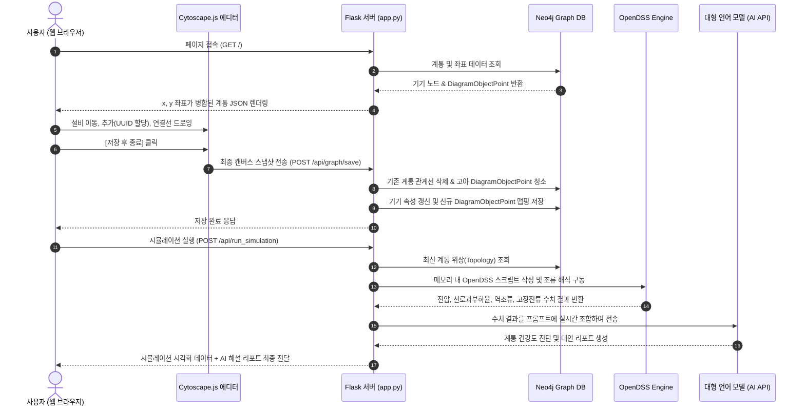

# 배전선로 웹 시뮬레이터 및 편집기 블록 다이어그램 (Block Diagram)

본 문서에는 이 프로젝트(`open_dss_project`)의 핵심 시스템 아키텍처, 구성 모듈, 그리고 데이터의 실시간 흐름이 정의되어 있습니다. 다른 개발자(또는 학생)들이 소스 코드의 기능을 쉽게 확장하거나 연동 개발을 진행할 때 참고할 수 있도록 Mermaid 다이어그램과 상세 설명을 제공합니다.

---

## 🧱 1. 전체 시스템 블록 다이어그램

이 시스템은 전형적인 **3계층 아키텍처 (3-Tier Architecture)** 구조로 동작합니다. 아래 다이어그램은 각 계층의 핵심 컴포넌트와 인터랙션 관계를 보여줍니다.

```mermaid
graph TD
    subgraph Frontend [1. Client - Web Browser (index.html)]
        direction TB
        UI[웹 UI 패널 <br/> 조회/편집 토글, 설비 도구함, 속성 인풋 폼]
        Cy[Cytoscape.js 시각화 엔진 <br/> 캔버스 드로잉, 줌/패닝 필터]
        Guide[정렬 가이드 및 스냅 모듈 <br/> 격자 스냅 25px, 수평/수직 빨간선 가이드]
        EditorCtrl[편집/저장 컨트롤러 <br/> UUID v4 발급, 캔버스 스냅샷 생성]
        
        UI <--> Cy
        Cy <--> Guide
        Cy --> EditorCtrl
    end

    subgraph Backend [2. Web Application Server (app.py)]
        direction TB
        Router[API 라우터 <br/> GET /api/graph, POST /save, POST /run_sim]
        SyncCtrl[DB 동기화 컨트롤러 <br/> UUID-ID 매핑, 고아 좌표점 삭제]
        DSSParser[OpenDSS 빌더/파서 <br/> Neo4j 위상 읽어 조류 계산 스크립트 빌드]
        LLM[LLM 분석 엔진 <br/> 프롬프트 엔지니어링 및 AI 해설서 생성]
        
        Router <--> SyncCtrl
        Router <--> DSSParser
        Router <--> LLM
    end

    subgraph DatabaseEngine [3. Database & Simulation Engine (Core)]
        direction TB
        Neo4j[Neo4j Graph DB <br/> 전력 설비 위상 및 DiagramObjectPoint]
        OpenDSS[OpenDSS Engine <br/> 4대 조류계산 모의 구동]
        
        SyncCtrl <--> Neo4j
        DSSParser <--> OpenDSS
        DSSParser <--> Neo4j
    end

    %% 데이터 흐름 연결
    UI -- (1) 편집/저장 요청 (JSON) --> Router
    Router -- (5) AI 리포트 & 그래프 갱신 (JSON) --> UI
    
    style Frontend fill:#1f2937,stroke:#3b82f6,stroke-width:2px,color:#fff
    style Backend fill:#1e293b,stroke:#10b981,stroke-width:2px,color:#fff
    style DatabaseEngine fill:#311b92,stroke:#8b5cf6,stroke-width:2px,color:#fff
```

---

## 🔄 2. 핵심 데이터 흐름 (Data Flow Sequence)

단선도를 편집하고 저장한 뒤 시뮬레이션을 구동하여 결과를 받아보는 전체적인 데이터의 처리 순서입니다.



---

## 📂 3. 소스 코드 컴포넌트별 역할 가이드

이 프로젝트는 크게 두 부분으로 구성되어 있어, 개발자가 원하는 방향에 맞춰 아래 컴포넌트를 확장하면 됩니다.

### 백엔드 컴포넌트 (`app.py`)
1. **`migrate_coordinates_schema()`**: 서버 기동 시 기존 데이터의 자체 좌표계를 `DiagramObjectPoint`로 자동 이관해 주는 초기화 함수
2. **`query_graph()`**: 그래프 렌더링을 위해 `DiagramObjectPoint`를 제외하되, 관계를 매칭하여 `x`, `y` 좌표를 기존 노드 JSON에 병합 반환해 주는 뷰어 데이터 쿼리 함수
3. **`save_graph()`**: 캔버스 수정 스냅샷을 받아 DB 데이터를 동적으로 갱신하고 고아 좌표 노드들을 가비지 컬렉션 처리해 주는 트랜잭션 관리 함수
4. **`_fetch_network()` / `run_simulation()`**: Neo4j의 계통 연결을 읽어 OpenDSS 모델로 정합하여 해석을 처리하는 연동 코어부

### 프론트엔드 컴포넌트 (`templates/index.html`)
1. **`initCytoscape(elements)`**: Cytoscape 객체 생성 및 기본 노드 스타일 정의, 그리고 마우스 휠 줌 제어용 리스너가 등록되는 UI 진입부
2. **`cy.gridGuide({...})`**: 편집 모드 상태에서 점(Dot) 형태의 은은한 흰색 격자 및 수평/수직 일치 시 빨간색 실시간 점선 정렬 가이드를 동적으로 그려주는 스냅 모듈
3. **`switchMode(toEdit)`**: 조회 모드와 편집 모드를 토글하며 캔버스의 이동 드래그 잠금(Ungrabify), 격자 보이기/안보이기, 우측 속성 변경 폼 패널의 동작 상태를 컨트롤하는 모드 상태 전이 모듈
4. **`saveCanvas()`**: 편집된 위상 스냅샷을 포착하고 새로 생긴 신규 객체에 UUID를 보존하여 백엔드 저장 API로 POST 비동기 호출해 주는 데이터 바인더
